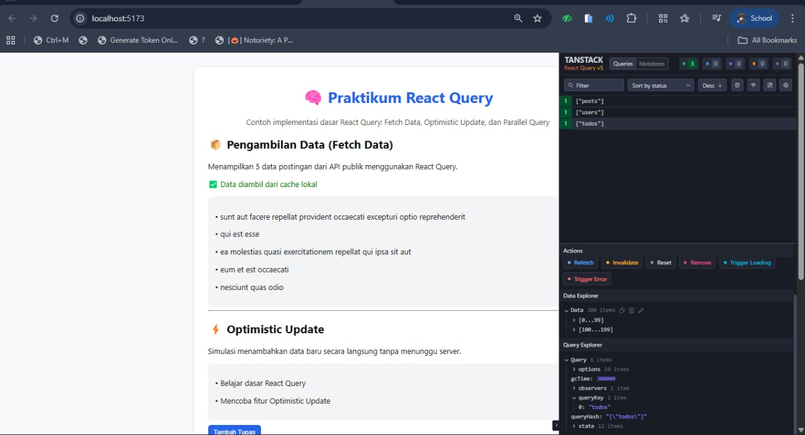

# Laporan Praktikum React Query

## Screenshot DevTools

Apakah menggunakan cache atau localStorage membuat aplikasi lebih baik?

Ya, menggunakan cache atau localStorage membuat aplikasi menjadi lebih baik karena:

Akses data lebih cepat. Data yang sudah pernah diminta tidak perlu diambil ulang dari server.

Mengurangi beban server. Permintaan API berkurang sehingga server lebih ringan.

Hemat kuota dan waktu. Pengguna tidak perlu menunggu lama untuk memuat ulang data.

Tetap bisa menampilkan data saat offline. localStorage menyimpan data di perangkat pengguna, jadi halaman tetap bisa dibuka meski tanpa koneksi.

Pengalaman pengguna lebih lancar. Transisi halaman terasa mulus karena data muncul instan dari cache.

Namun, cache dan localStorage tetap perlu dibersihkan atau diperbarui secara berkala agar tidak menampilkan data lama.
